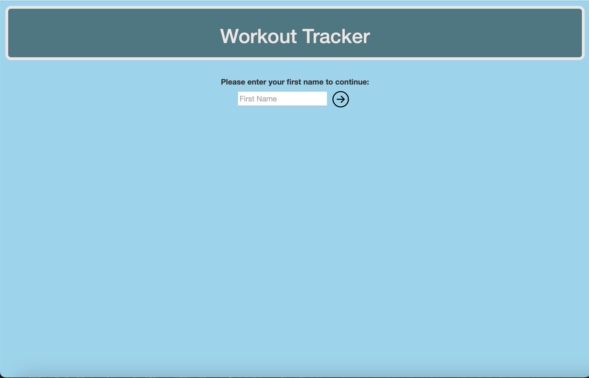

# Workout Tracker
Group Project #1

## Links
[Link to Deployed Application](URL)

[GitHub Repository](https://github.com/PaulRusz/Group-Project1)

## User Story
```
AS A dedicated fitness enthusiast,
I WANT an effective workout planning and progress tracking tool,
SO THAT I can maintain a well-organized, daily-tailored fitness schedule, closely monitor my progress, and stay motivated to consistently prioritize my health.
```

## Acceptance Criteria
```
GIVEN a Workout Tracker website,
WHEN the user visits the website for the first time,
THEN a web page appears that allows them to input their first name to continue.
WHEN the user submits their first name,
THEN the H1 "Workout Tracker" will also display their name at the top of the page.
THEN a random quote will be displayed using Quotable API.
THEN the Exercise Form and Calendar will be displayed.
THEN today's date and time will be displayed below the header using Day.js.

WHEN the user returns to the web page,
THEN they will be brought directly to their Workout Tracker.

WHEN the user clicks on the "<" (Previous) Button in the Calendar,
THEN the calendar will display the previous month, its dates, and the corresponding year.
WHEN the user clicks on the ">" (Next) Button in the Calendar,
THEN the calendar will display the next month, its dates, and the corresponding year.
WHEN the user hovers over a past date in the Calendar,
THEN that date will display in the color red.
WHEN the user hovers over today's date in the Calendar,
THEN that date will display in the color green.
WHEN the user hovers over a future date in the Calendar,
THEN that date will display in the color gray.
WHEN the user clicks on a date in the Calendar,
THEN a popover will appear with the exercises the user chose for that day and the status of those exercises.
WHEN the user clicks on the "Today" button in the Calendar,
THEN the Calendar will navigate to the current month.

WHEN the user clicks on "Choose an Exercise Type",
THEN a list of workout categories is displayed.
WHEN the user clicks on "Exercises:" after selecting a workout category,
THEN they will return to the list of workout categories and can select a different category.

WHEN the user selects a workout category of their choosing,
THEN a list of exercises that correlate to their selected workout category will display.
WHEN the user clicks the checkbox next to an exercise,
THEN that exercise is stored and listed in their Workout Planner.
WHEN the user clicks the "Begin Workout" button,
THEN the page content is replaced with their Workout Planner.

WHEN the user has selected a workout category,
THEN the user will see a message pertaining to their selected workout category within the Workout Planner.
WHEN an exercise is added to the Workout Planner,
THEN it contains an option for the user to input a quantity that relates to the exercise's designated amount of time or reps.
THEN it contains a checkbox to indicate whether or not the exercise has been completed yet.
WHEN the user hovers over an exercise name within the Workout Planner,
THEN a popover appears that displays a picture of the exercise and information about the exercise.
WHEN the user clicks on the "Return Home" button,
THEN the user will return to their Workout Tracker.
```

## Description

## Visuals
This is the landing page for users when they visit the website for the first time:


This is the landing page for users who have visited before and have submitted their first name:


## Usage

## Authors and Acknowledgement
**Main Contributors:** [Emily Simone](https://github.com/emsim11), [Paul Ruszkay](https://github.com/PaulRusz), and [Tania Bezerra](https://github.com/nybrasil)

## License


